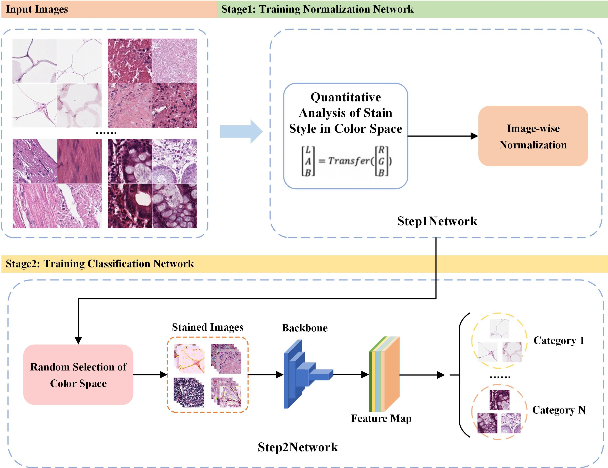
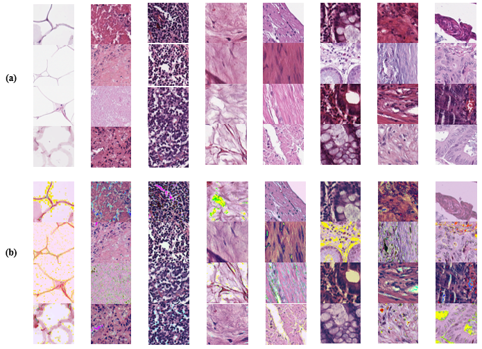

# LAN
Learnable Automatic Stain Normalization For Histology Image Analysis
Implementation for the paper: "Learnable Stain Normalization For Histology Image Analysis" [MICCAI 2024]
## 1. Method Overview

The "Learnable Automatic Normalization" (LAN) method 
represents an innovative approach in image processing technology, leveraging 
deep learning to autonomously adjust normalization parameters, thus overcom
ing the limitations of traditional normalization techniques. This method employs 
deep learning models to learn the optimal normalization strategy based on im
age content and application requirements, facilitating end-to-end training driven 
directly by task performance. Such an adaptive learning mechanism allows LAN 
to accommodate various image conditions, including changes in illumination and 
quality differences, significantly enhancing performance in visual tasks such as 
recognition, detection, and segmentation. However, this approach demands a 
high volume of training data to ensure the learned parameters possess broad 
applicability and robustness. Moreover, the autonomous learning of normaliza
tion parameters may increase the complexity and duration of model training


## 2. Code Organizations
baseline_xxx.py, where xxx represents the neural network model;
main_xxx.py, xxx represents each type of network model as well as improvements to our method;
gen_hsv_images.py, for generating HSV files;
ResNet.py, for the ResNet structure code;
network_v2.py, for the overall model structure;
utility.py, for methods required during model training;
train3.py, for the training process of the entire framework;
reconstruct_image.py, for the model's method of reconstructing images.

## 3. Set Up the Environmets
Run

```bash
pip install -r requirements.txt
```